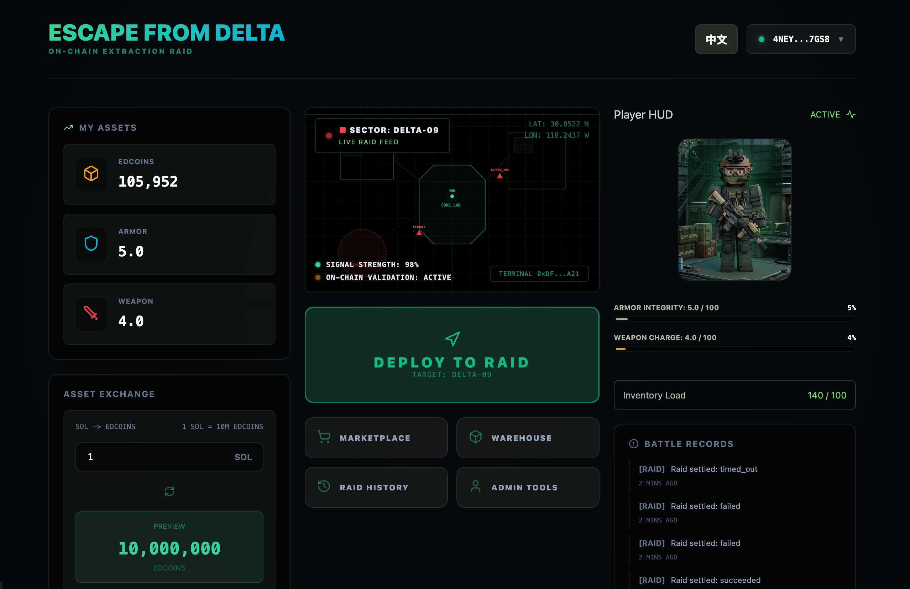

# Escape from Delta

Escape from Delta is a Solana-backed PVE extraction raid demo with EDcoins,
warehouse assets, marketplace listings, battle records, and admin difficulty
configuration.

## Devnet Setup

1. Install Anchor, Rust, Node.js, and the Solana CLI.
2. Create local env files:
   - `cp .env.example .env.local`
   - `cp app/.env.example app/.env.local`
3. Update the local env files if you need custom values. At minimum, keep:
   - `PROGRAM_ID=7ueVgYfrwidjpwMCBfGyHCoVpaVNe7Ep1h2Mxv1ENBYQ`
   - `SESSION_KEYS_PROGRAM_ID=KeyspM2ssCJbqUhQ4k7sveSiY4WjnYsrXkC8oDbwde5`
   - `NEXT_PUBLIC_PROGRAM_ID=7ueVgYfrwidjpwMCBfGyHCoVpaVNe7Ep1h2Mxv1ENBYQ`
   - `NEXT_PUBLIC_SESSION_KEYS_PROGRAM_ID=KeyspM2ssCJbqUhQ4k7sveSiY4WjnYsrXkC8oDbwde5`
   - `NEXT_PUBLIC_RPC_URL=https://api.devnet.solana.com`
   - `ANCHOR_PROVIDER_URL=https://api.devnet.solana.com`
4. Install dependencies with `npm install`.
5. Point your Solana CLI and wallet to devnet.

## Commands

- `anchor build`
- `anchor test`
- `npm run generate:client`
- `npm run test:client`
- `npm run test:app`
- `npm run dev`
- `npm run demo:local`
- `npm run query:records -- --wallet <PLAYER_WALLET> --cluster devnet --format table`

## Devnet Smoke Run

1. Set your CLI to devnet:
   - `solana config set --url https://api.devnet.solana.com`
2. Make sure local env files exist:
   - `cp .env.example .env.local`
   - `cp app/.env.example app/.env.local`
3. The repo is expected to use the already-deployed devnet program:
   - `7ueVgYfrwidjpwMCBfGyHCoVpaVNe7Ep1h2Mxv1ENBYQ`
4. Airdrop SOL to the test wallet:
   - `solana airdrop 2`
5. Run the demo raid flow against devnet:
   - `ANCHOR_PROVIDER_URL=https://api.devnet.solana.com RPC_URL=https://api.devnet.solana.com npm run demo:local`
6. Query the resulting battle record:
   - `npm run query:records -- --wallet $(solana address) --cluster devnet --format table`

## Teammate Quick Start

Teammates should use the already-deployed devnet program and do not need to deploy anything.

1. Clone the repo.
2. Create env files:
   - `cp .env.example .env.local`
   - `cp app/.env.example app/.env.local`
3. Install dependencies:
   - `npm install`
4. Start the web app:
   - `npm run dev`
5. Open:
   - `http://localhost:3000`
6. In Phantom:
   - switch to `devnet`
   - make sure the wallet has devnet SOL

The expected devnet program is:

- `7ueVgYfrwidjpwMCBfGyHCoVpaVNe7Ep1h2Mxv1ENBYQ`

If `Start Raid` fails during `session/create`, first verify:

- `NEXT_PUBLIC_PROGRAM_ID=7ueVgYfrwidjpwMCBfGyHCoVpaVNe7Ep1h2Mxv1ENBYQ`
- `NEXT_PUBLIC_SESSION_KEYS_PROGRAM_ID=KeyspM2ssCJbqUhQ4k7sveSiY4WjnYsrXkC8oDbwde5`
- `NEXT_PUBLIC_RPC_URL=https://api.devnet.solana.com`

## Session Keys

- Program-side session auth is enabled for raid in-session actions:
  - `open_container`
  - `fight_enemy`
  - `move_area`
  - `select_safe_case_items`
- Session Keys program id:
  - `KeyspM2ssCJbqUhQ4k7sveSiY4WjnYsrXkC8oDbwde5`
- The app session manager is configured for `devnet` by default.

## Transaction Safety

Clients must show intent, cluster, fee payer, account list, amounts, and
simulation result before requesting wallet approval. Devnet is the default target
for this demo.
